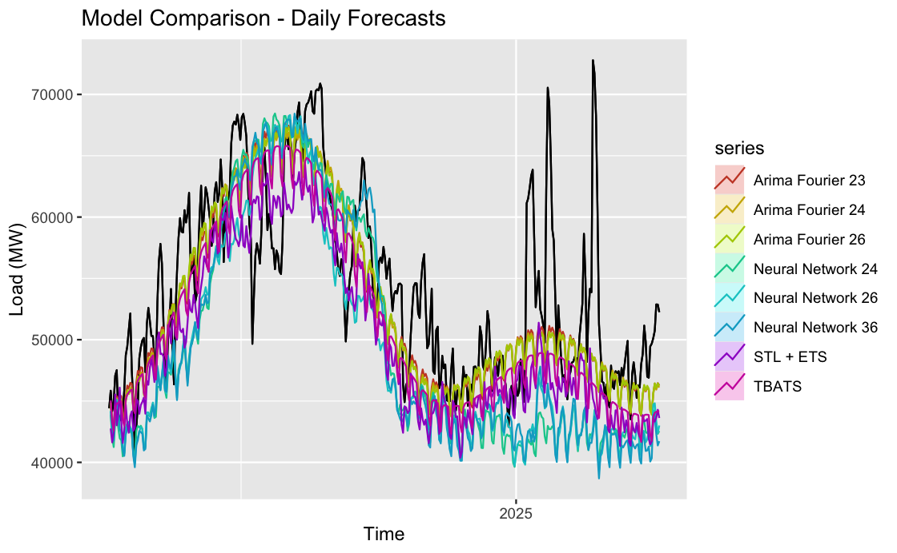

```{r setup, include=FALSE}
knitr::opts_chunk$set(echo = TRUE)
#tinytex::install_tinytex()
```

```{r, include=FALSE}
library(rvest);library(dataRetrieval);library(tidyverse);library(lubridate);library(viridis)
library(here);library(httr);library(jsonlite);library(knitr);library(kableExtra)
library(ggplot2);library(forecast);library(Kendall);library(tseries);library(outliers)
library(tidyverse);library(smooth);library(zoo)
here()
```

```{r data pull, include=FALSE}
#read csv files
ERCOT_fuelmix_2017to2018 <- read.csv(file="./Raw_Data/ERCOT_fuel_mix_112017_12312018.csv")
ERCOT_fuelmix_2019to2021 <- read.csv("./Raw_Data/ERCOT_fuel_mix_112019_12312021.csv")
ERCOT_fuelmix_2022to2025 <- read.csv("./Raw_Data/ERCOT_fuel_mix_112022_442025.csv")
ERCOT_fuelmix <- rbind(
  ERCOT_fuelmix_2017to2018,
  ERCOT_fuelmix_2019to2021,
  ERCOT_fuelmix_2022to2025
)


ERCOT_load_2017to2019 <- read.csv("./Raw_Data/ERCOT_load_112017_12312019.csv")
ERCOT_load_2020to2022 <- read.csv("./Raw_Data/ERCOT_load_112020_12312022.csv")
ERCOT_load_2023to2025 <- read.csv("./Raw_Data/ERCOT_load_112023_442025.csv")
ERCOT_load <- rbind(
  ERCOT_load_2017to2019,
  ERCOT_load_2020to2022,
  ERCOT_load_2023to2025
)

ERCOT_Temp_2017to2019 <- read.csv("./Raw_Data/ERCOT_Temp_112017_112020.csv")
ERCOT_Temp_2020to2023 <- read.csv("./Raw_Data/ERCOT_Temp_112020_112023.csv")
ERCOT_Temp_2023to2025 <- read.csv("./Raw_Data/ERCOT_Temp_112023_452025.csv")
ERCOT_temp <- rbind(
  ERCOT_Temp_2017to2019,
  ERCOT_Temp_2020to2023,
  ERCOT_Temp_2023to2025
)

```

```{r ts object creation, include=FALSE}
ERCOT_fuelmix$Date <- as.Date(ERCOT_fuelmix$interval_start_local)
ERCOT_load$Date <- as.Date(ERCOT_load$interval_start_local)

ERCOT_temp$Date <- as.Date(ERCOT_temp$interval_start_local)
ERCOT_temp$Average <- rowMeans(ERCOT_temp[,7:14], na.rm = FALSE, dims = 1)
ERCOT_temp_daily <- ERCOT_temp %>% 
  group_by(Date) %>% 
  summarise(mean(Average)) %>% 
  ungroup()

ts_load <- msts(ERCOT_load$load, seasonal.periods = c(7,365.25), 
                start = c(2017,1,1))
ts_temp <- msts(ERCOT_temp_daily[,2], seasonal.periods = c(7,365.25), 
                start = c(2017,1,1))
ts_coal_and_lignite <- msts(ERCOT_fuelmix$coal_and_lignite, seasonal.periods = c(7,365.25), 
                start = c(2017,1,1))
ts_hydro <- msts(ERCOT_fuelmix$hydro, seasonal.periods = c(7,365.25), 
                start = c(2017,1,1))
ts_nuclear <- msts(ERCOT_fuelmix$nuclear, seasonal.periods = c(7,365.25), 
                start = c(2017,1,1))
ts_solar <- msts(ERCOT_fuelmix$solar, seasonal.periods = c(7,365.25), 
                start = c(2017,1,1))
ts_wind <- msts(ERCOT_fuelmix$wind, seasonal.periods = c(7,365.25), 
                start = c(2017,1,1))
ts_natural_gas <- msts(ERCOT_fuelmix$natural_gas, seasonal.periods = c(7,365.25), 
                start = c(2017,1,1))

```

```{r train/test split, include=FALSE}
n_for <-  365

ts_load_train <- subset(ts_load,end = length(ts_load)-n_for) #stops 365 days before

#create a subset for testing purpose
ts_load_test <- subset(ts_load, start = length(ts_load)-n_for) #last 365 observations
```

#GitHub Repository Link

https://github.com/alex-lopez70/ChuangWhiteheadLopez_ENV797_TSA_FinalProject 

# Introduction and Motivation

Load growth used to be fairly stagnant and was managed by implementing more efficiency measures (Walton, 2023). However, with innovation in electrical technologies (EVs, heat pumps, etc.) and the introduction of new load sources (crypto mining and data centers), electrical load has skyrocketed in recent years. As a result, we need new and innovative measures of responding to this load growth, such as demand response, interconnection reform, among others. The ability to forecast load growth is an interesting task, because there are both general trends (growth in electric technologies, climate change, and increasing electrification, among others) and seasonal trends (periodic variations in energy demand and consumption) that impact load.

# Relevance and Objectives

In the US, ERCOT is a market witnessing tremendous load growth. In 2018, summer peak load record was 69.5 GW, but in just 5 years, this record was broken with a 16 GW increase, with the new record hitting 85.6 GW (Wilson and Zimmerman, 2023). Moreover, ERCOT set a new winter demand peak in February 2025 with load being above 80 GW for the first time, similar figures usually seen in summer months, which highlights load growth not being exclusive to the summer (Kleckner, 2025). A lot of this can be attributed to crypto mining facilities, data centers, and industrial electrification (Guo, 2025).

At the same time, ERCOT has had some really exciting developments, from being the wholesale market with the greatest growth in solar PV and battery storage, to having the fastest interconnection process out of all the ISO/RTOs in the US, making ERCOT one of the most dynamic electric wholesale markets in North America. These developments have all helped ERCOT respond to load growth in the wake of extreme weather events like Winter Storm Uri in 2021. In this context, being able to better forecast load growth in ERCOT will help contribute to greater innovation in policy and technology to support load growth while continuing to reliably serve pre-existing load.

# Dataset Information

The ERCOT load dataset was collected from GridStatus.io, a website and Python library that provides a uniform API for accessing electricity supply, demand, and pricing data for the major ISOs in the United States (https://www.gridstatus.io/live). 

## Description

Using its “Export Data” tool, we queried hourly temperature and daily load and fuel mix data for ERCOT from January 2017 to April 2025. Below is a description of the data set retrieved: 

```{r echo=FALSE}
#data set description
dataset_description <- data.frame(
  Column1 = c("Units", "Frequency", "Subsets"),
  Load = c("MW", "Daily", ""),
  Temperature = c("Fahrenheit", "Hourly", "ERCOT Zone"),
  FuelMix = c("MW", "Daily", "Fuel (Coal and lignite, Hydro, Nuclear,
                 Solar, Wind, Natural Gas)")
)

dataset_description$Column1 <- cell_spec(dataset_description$Column1, bold = TRUE)

# Create the kable table with the first column bolded
kbl(dataset_description, caption = "Data Set Description", 
    col.names = c("", "Load", "Temperature", "Fuel Mix"), escape = FALSE) %>%
  kable_styling(full_width = FALSE, position = "center", latex_options = "hold_position") %>%
  kable_styling(latex_options="striped")

```

## Data Wrangling

The earliest available data for ERCOT fuel mix was from January 2017, so we decided to retrieve load, temperature, and fuel mix data from January 2017 onwards. After importing each of these three data sets (daily values except for temperature data) for the dates 1 January 2017 to 4 April 2025 and converting them to data frames, we created a new 'Date' column for each of the three date sets that converted the time given in the 'interval_start_local' to a YYYY-MM-DD format. Regarding the temperature data, since it is hourly data divided by zone, we first found the hourly average for each zone, then the daily average for each zone, and finally we found the daily average using all the zones in ERCOT by using rowMeans(), group_by(), and summarise(). We split the data into training and testing subsets: testing data encompasses the last 365 days of data, while the rest was classified as the training data.

Since we are working with higher frequency data with multiple seasonalities, we are using the `msts` class from package `forecast` to create time series objects for our daily data sets. Unlike the ts() function, reserved for data exhibiting single seasonality, the msts() function allows for non-integer frequency specification. We therefore created eight time series objects, one for load, one for temperature, and one for each of the fuels we are analyzing, namely coal and lignite, hydro, nuclear, solar, wind, and natural gas, with a 'seasonal.period = c(7, 365.25)' for each. Below are summaries of the data structures of each of the three wrangled data frames (for load, temperature, and fuel mix) that were then used to create time series objects by using msts():

```{r data.summary, echo=FALSE}
ERCOT_load_summary <- data.frame(
  Variable = c('interval_start_local', 'interval_start_utc', 'interval_end_local',
               'interval_end_utc', 'load', 'Date'),
  Description = c('Start Time for the Day', 'Start Time for the Day (UTC)',
                  'End Time for the Day', 'End Time for the Day (UTC)', 'Load (MW)',
                  'Date (YYYY-MM-DD)'),
  Units = c('Character', 'Character', 'Character', 'Character', 'Numeric', 
            'Date')
)

ERCOT_temp_summary <- data.frame(
  Variable = c('Date', 'mean(Average)'),
  Description = c('Date (YYYY-MM-DD)', 'Average Daily Temperature (Fahrenheit)'),
  Units = c('Date', 'Numeric')
)

ERCOT_fuelmix_summary <- data.frame(
  Variable = c('interval_start_local', 'interval_start_utc', 'interval_end_local',
               'interval_end_utc', 'coal_and_lignite', 'hydro', 'nuclear', 
               'solar', 'wind', 'natural_gas'),
  Description = c('Start Time for the Day', 'Start Time for the Day (UTC)',
                  'End Time for the Day', 'End Time for the Day (UTC)',
                  'Generation from Coal and Lignite (MW)',
                  'Generation from Hydro (MW)', 'Generation from Nuclear (MW)',
                  'Generation from Solar (MW)', 'Generation from Wind (MW)',
                  'Generation from Natural Gas (MW)'),
  Units = c('Character', 'Character', 'Character', 'Character', 'Numeric', 
            'Numeric', 'Numeric', 'Numeric', 'Numeric', 'Numeric')
)

#creating a monthly data set
ERCOT_load_monthly <- ERCOT_load %>%
  mutate(month = floor_date(Date, "month")) %>%
  group_by(month) %>%
  summarise(load = mean(load, na.rm = TRUE))

ts_load_monthly <- ts(ERCOT_load_monthly$load, frequency = 12, start = c(2017, 1))
ts_load_monthly_train <- subset(ts_load_monthly, end = length(ts_load_monthly)-12)
ts_load_monthly_test <- subset(ts_load_monthly, start = length(ts_load_monthly)-12)

```

```{r table1, echo=FALSE}
kable(ERCOT_load_summary, caption = "ERCOT Load Summary")
```


```{r table2, echo=FALSE}
kable(ERCOT_temp_summary, caption = "ERCOT Daily Temperature Summary")
```


```{r table3, echo=FALSE}
kable(ERCOT_fuelmix_summary, caption = "ERCOT Fuel Mix Summary")
```
# Data Exploration

To better understand the dynamics of electricity consumption and generation in the ERCOT region, we wanted to visualize our time series data (using the autoplot() function). These visuals gave us insights into long-term trends and seasonal patterns in ERCOT load, temperature, and the evolving fuel mix. By looking at these trends, we could spot times of high demand and see how temperature changes affect energy use. We also noticed shifts in the fuel mix, showing how the region is moving toward more sustainable energy sources.

## ERCOT Load

The ERCOT load has shown a steady increase from 2017 to 2025. This rise reflects growing residential and industrial electricity consumption, which could be attributed to population growth, economic development, and infrastructure expansion across Texas. Seasonal fluctuations are also apparent, with noticeable peaks during periods of extreme temperatures, particularly in the summer and winter months.

[ts autoplot here]

[ACF and PACF graphs and info for load here]

## ERCOT Temperature

As mentioned before, the temperature data was averaged daily for each zone and then combined to get an overall ERCOT-wide daily average. This change helped us match the temperature data with load and fuel mix data. As expected, temperature patterns showed strong seasonality, with summer highs and winter lows corresponding to fluctuations in load. 

[ts autoplot here]

[ACF and PACF graphs and info for load here]

## ERCOT Fuel Mix

ERCOT’s fuel mix shows significant shifts over time. Natural gas remains the most relevant and responsive energy source, with a load shape closely mirroring the overall ERCOT demand curve. Coal and lignite usage has declined steadily, and this aligns with national efforts to reduce reliance on fossil fuels, as renewables such as wind and solar have shown steady increase. ERCOT's nuclear generation and hydroelectric power have both remained stable, though we should note that hydroelectric has very minimal contribution.

[ts autoplot here]

[ACF and PACF graphs and info for load here]

# Methodology and Models

Modeling ERCOT load is inherently complex due to the presence of multiple seasonal patterns, non-linearities, and variability driven by weather, human behavior, and market conditions. To capture these dynamics, we used a varity of time series models, each offering unique strengths.

## Models with Daily Data

### STL + ETS

STL + ETS combines two powerful methods: Seasonal and Trend decomposition using Loess (STL) and Exponential Smoothing (ETS). STL decomposes the time series into its seasonal, trend, and remainder components by using local smoothing techniques. Then, ETS applies exponential smoothing to each of the seasonal, trend, and remainder components to produce forecasts. This hybrid approach is particularly effective for modeling complex and potentially evolving seasonal patterns and trends in load data, as it allows the model to adapt to changing dynamics over time. By separately forecasting each component, it ensures better accuracy in the final forecast, especially when the data exhibits smooth, but also varying, seasonality or trends.

```{r echo=FALSE}
ETS_fit <-  stlf(ts_load_train, h=365)

#forecasting results
autoplot(ETS_fit) + 
  ylab("Load (MW)") +
  labs(caption = "Forecasting Results from STL + ETS") +
  theme(plot.caption = element_text(hjust = 0.5))

#model + observed data
autoplot(ts_load) +
  autolayer(ETS_fit, PI=FALSE) +
  ylab("Load (MW)") +
  labs(title = "STL + ETS Forecast",
       caption = "Observed Data and Forecasting Results from STL + ETS") +
  theme(plot.caption = element_text(hjust = 0.5))
```

### TBATS

TBATS (Trigonometric Seasonalities, Box-Cox Transformation, ARMA Errors, Trend, and Seasonal Components) is well-suited for modeling ERCOT load due to its ability to capture multiple and non-integer seasonalities, such as daily and weekly cycles, as well as complex seasonal interactions. The model's flexibility in handling complex patterns and its scalability for longer-term forecasts make it a valuable method for accurate long-term load forecasting in dynamic systems like ERCOT.

```{r echo=FALSE}
TBATS_fit <- tbats(ts_load_train)

TBATS_forecast <- forecast(TBATS_fit, h=365)

#forecasting results
autoplot(TBATS_forecast) + 
  ylab("Load (MW)") +
  labs(caption = "Forecasting Results from TBATS") +
  theme(plot.caption = element_text(hjust = 0.5))

#model + observed data
autoplot(ts_load) +
  autolayer(TBATS_forecast, PI=FALSE) +
  ylab("Load (MW)") +
  labs(title = "TBATS Forecast",
       caption = "Observed Data and Forecasting Results from TBATS") +
  theme(plot.caption = element_text(hjust = 0.5))
```

### ARIMA + Fourier Terms

This method integrates traditional autoregressive modeling with Fourier terms as exogenous regressors, effectively capturing recurring seasonal patterns like daily temperature-related demand fluctuations. This approach enhances ARIMA's forecasting performance for load data by explicitly modeling periodicities without the need for differencing seasonal components.

Since the ARIMA + Fourier terms model is a good option for modeling multiple seasonalities, we ran a few models with a variety of K parameters. K is a vector of integers specifying the number of sine and cosine terms for each of the seasonal periods. For our four ARIMA + Fourier models, we used the following K parameters: K=c(2,3); K=c(2,4); K=c(2,6); and K=c(3,6). This means that there are 10, 12, 16, and 18 total regressors, respectively, represented by the Fourier terms, allowing us to capture the seasonal patterns typically present in load data such as the one analyzed in this report.

```{r echo=FALSE}
#AF23
ARIMA_Fourier_fit23 <- auto.arima(ts_load_train, 
                             seasonal=FALSE, 
                             lambda=0,
                             xreg=fourier(ts_load_train, 
                                          K=c(2,3)))

ARIMA_Fourier_forec23 <- forecast(ARIMA_Fourier_fit23,
                           xreg=fourier(ts_load_train,
                                        K=c(2,3),
                                        h=365),
                           h=365) 

#forecasting results
autoplot(ARIMA_Fourier_forec23) +
  ylab("Load (MW)") +
  labs(caption = "Forecasting Results from ARIMA+Fourier with K=c(2,3)") +
  theme(plot.caption = element_text(hjust = 0.5))

#AF24
ARIMA_Fourier_fit24 <- auto.arima(ts_load_train, 
                             seasonal=FALSE, 
                             lambda=0,
                             xreg=fourier(ts_load_train, 
                                          K=c(2,4)))

ARIMA_Fourier_forec24 <- forecast(ARIMA_Fourier_fit24,
                           xreg=fourier(ts_load_train,
                                        K=c(2,4),
                                        h=365),
                           h=365) 

#forecasting results
autoplot(ARIMA_Fourier_forec24) +
  ylab("Load (MW)") +
  labs(caption = "Forecasting Results from ARIMA+Fourier with K=c(2,4)") +
  theme(plot.caption = element_text(hjust = 0.5))

#AF26
ARIMA_Fourier_fit26 <- auto.arima(ts_load_train, 
                             seasonal=FALSE, 
                             lambda=0,
                             xreg=fourier(ts_load_train, 
                                          K=c(2,6)))

ARIMA_Fourier_forec26 <- forecast(ARIMA_Fourier_fit26,
                           xreg=fourier(ts_load_train,
                                        K=c(2,6),
                                        h=365),
                           h=365) 

#forecasting results
autoplot(ARIMA_Fourier_forec26) +
  ylab("Load (MW)") +
  labs(caption = "Forecasting Results from ARIMA+Fourier with K=c(2,6)") +
  theme(plot.caption = element_text(hjust = 0.5))

#AF36
ARIMA_Fourier_fit36 <- auto.arima(ts_load_train, 
                             seasonal=FALSE, 
                             lambda=0,
                             xreg=fourier(ts_load_train, 
                                          K=c(3,6)))

ARIMA_Fourier_forec36 <- forecast(ARIMA_Fourier_fit36,
                           xreg=fourier(ts_load_train,
                                        K=c(3,6),
                                        h=365),
                           h=365) 

#forecasting results
autoplot(ARIMA_Fourier_forec36) +
  ylab("Load (MW)") +
  labs(caption = "Forecasting Results from ARIMA+Fourier with K=c(3,6)") +
  theme(plot.caption = element_text(hjust = 0.5))


```

```{r echo=FALSE}
#forecasting all AF models + observed data
autoplot(ts_load) +
  autolayer(ARIMA_Fourier_forec23, series="K = c(2,3)", PI=FALSE) +
  autolayer(ARIMA_Fourier_forec24, series="K = c(2,4)", PI=FALSE) +
  autolayer(ARIMA_Fourier_forec26, series="K = c(2,6)", PI=FALSE) +
  autolayer(ARIMA_Fourier_forec36, series="K = c(3,6)", PI=FALSE) +
  ylab("Load (MW)") +
  labs(title = "All ARIMA + Fourier Forecasts", 
       caption = "Observed Data and Forecasting Results from AF23, AF24, AF26, AF36 Models") +
  theme(plot.caption = element_text(hjust = 0.5))
```

### Neural Networks

Neural networks incorporate lagged values and Fourier terms as inputs to model complex time series like ERCOT load data. They excel at capturing non-linear relationships that traditional linear models (like ARIMA) may struggle with. By using historical load patterns and multiple seasonal indicators, neural networks can adapt to complex seasonal behaviors, including interactions between short-term and long-term effects. The inclusion of lagged inputs (p) and seasonal lags (P) allows the neural network to model both short- and long-term dependencies, making it analogous to SARIMA models, but with the added advantage of capturing non-linearity.

For our three Neural Network models, we used the following K parameters: K=c(2,4); K=c(2,6); and K=c(3,6). This means that there are 12, 16, and 18 total exogenous regressors modeled by Fourier terms, respectively. In each neural network model, the autoregressive parameters were set to p=1 and P=1. Each model therefore incorporates the most recent observation and one seasonal observation. This allows the models to learn both short-term dependencies (like immediate trends or sudden spikes) and long-term seasonal structure (like daily or weekly cycles). Combined with the Fourier terms, this structure enhances the model’s ability to capture the complex, non-linear, and multi-seasonal behavior characteristic of ERCOT load data.

```{r echo=FALSE}
#NN24
NN_fit_24 <- nnetar(ts_load_train, p=1, P=1,
                 xreg=fourier(ts_load_train, K=c(2,4)))

NN_forec_24 <- forecast(NN_fit_24, h=365, xreg=fourier(ts_load_train, 
                                          K=c(2,4), h=365))

#forecasting results
autoplot(NN_forec_24) +
  ylab("Load (MW)") +
  labs(caption = "Forecasting Results from Neural Network with K=c(2,4)") +
  theme(plot.caption = element_text(hjust = 0.5))

#NN26
NN_fit_26 <- nnetar(ts_load_train, p=1, P=1,
                 xreg=fourier(ts_load_train, K=c(2,6)))

NN_forec_26 <- forecast(NN_fit_26, h=365, xreg=fourier(ts_load_train, 
                                          K=c(2,6), h=365))

#forecasting results
autoplot(NN_forec_26) +
  ylab("Load (MW)") +
  labs(caption = "Forecasting Results from Neural Network with K=c(2,6)") +
  theme(plot.caption = element_text(hjust = 0.5))

#NN36
NN_fit_36 <- nnetar(ts_load_train, p=1, P=1,
                 xreg=fourier(ts_load_train, K=c(3,6)))

NN_forec_36 <- forecast(NN_fit_36, h=365, xreg=fourier(ts_load_train, 
                                          K=c(3,6), h=365))

#forecasting results
autoplot(NN_forec_36) +
  ylab("Load (MW)") +
  labs(caption = "Forecasting Results from Neural Network with K=c(3,6)") +
  theme(plot.caption = element_text(hjust = 0.5))

```

```{r echo=FALSE}
#forecasting all NN models + observed data
autoplot(ts_load) +
  autolayer(NN_forec_24, series="K = c(2,4)", PI=FALSE) +
  autolayer(NN_forec_26, series="K = c(2,6)", PI=FALSE) +
  autolayer(NN_forec_36, series="K = c(3,6)", PI=FALSE) +
  ylab("Load (MW)") +
  labs(title = "All Neural Network Forecasts", 
       caption = "Observed Data and Forecasting Results from NN24, NN26, NN36 Models") +
  theme(plot.caption = element_text(hjust = 0.5))

```

## Models with Monthly Data

### Seasonal ARIMA

The seasonal ARIMA (SARIMA) autofits single-seasonality patterns through differencing and autoregressive/moving average components. This model is suitable when ERCOT load displays dominant recurring seasonal trends. Although it cannot model multiple seasonalities simultaneously, SARIMA remains a strong baseline for data with clear, stable seasonal structure.

```{r echo=FALSE, message=FALSE, warning=FALSE}
SARIMA_autofit <- auto.arima(ts_load_monthly_train)

checkresiduals(SARIMA_autofit)

SARIMA_forecast <- forecast(SARIMA_autofit, h=12)

autoplot(SARIMA_forecast) +
  labs(y = "Load (MW)",
       x = "Time",
       caption = "Forecasting Results from SARIMA") +
  theme(plot.caption = element_text(hjust = 0.5))

```

### State Space Exponential Smoothing

State Space Exponential Smoothing (SSES) offers a probabilistic and flexible approach to forecasting, modeling uncertainty while capturing both trend and seasonality. It automatically selects among additive or multiplicative trend and seasonal components based on the data, making it well-suited for monthly ERCOT load data where seasonal strength and trend can evolve over time. Its ability to model uncertainty and structural changes without manual re-specification is especially useful when trying to capture varying patterns.

```{r echo=FALSE, message=FALSE, warning=FALSE}
SSES_seas <- es(ts_load_monthly_train, model="ZZZ", h=12, holdout=FALSE)

checkresiduals(SSES_seas)

SSES_forecast <- forecast(SSES_seas, h=12)

plot(SSES_forecast, ylab = "Load (MW)", xlab = "Time")

mtext("Forecasting Results from SS Exponential Smoothing", side = 1, line = 4, cex = 0.75)

```

### Structural Bayesian State Space Model

Structural Bayesian State Space Model (SSBSM) is also a probabilistic framework, and it assumes that all components (trend, seasonality, irregularity) are stochastic and can evolve over time. This allows each element to change dynamically, providing robustness in the face of structural shifts due to climate variability, policy changes, or demand-side management. For monthly ERCOT load forecasting, this model is a suitable option when long-term patterns are not fixed and may change unpredictably.

```{r echo=FALSE, message=FALSE, warning=FALSE}
SS_seas <- StructTS(ts_load_monthly_train, type="BSM", fixed=c(NA,NA,NA,NA))

checkresiduals(SS_seas)

SS_forecast <- forecast(SS_seas, h=12)

autoplot(SS_forecast) +
  labs(y = "Load (MW)",
       x = "Time",
       caption = "Forecasting Results from SS Basic Structure Model") +
  theme(plot.caption = element_text(hjust = 0.5))

```

### Scenario Generation

Lastly, we did scenario generation using Cholesky decomposition, which allowed us to create multiple realistic future ERCOT load forecasts by simulating correlated input variables. First, we calculate the historical covariance matrix of the load and the 7 predictors. Then, using Cholesky decomposition, we broke this matrix into a lower triangular matrix that captures the variables' dependencies. By multiplying random normal samples by this matrix, we generated new input scenarios that preserve historical correlations. These are then fed into an ARIMA + Fourier forecasting model to produce a range of potential load trajectories. Doing this helps to capture uncertainty in both the predictors and their influence on load.

```{r echo=FALSE}

```
This ARIMA + Fourier + exogenous variables model with Cholesky-based scenario generation shows overall trends well, but it doesn’t seem to capture large spikes in load that we were expecting (i.e. more values in the 60-70 GW range). The scenarios mostly stay close to the mean of the original data set and don’t reflect the more extreme values we sometimes see in actual data. This might be because Cholesky decomposition uses a multivariate normal distribution, which keeps the correlations between variables but tends to produce values clustered around the average, without many extreme highs or lows.

# Results and Model Comparisons

```{r echo=FALSE, message=FALSE, warning=FALSE}
ALLscores <- read_csv("ALLscores.csv")
names(ALLscores)[1] <- "Model"
kbl(ALLscores, 
    caption = "Forecast Accuracy for Load", 
    digits = 5) %>%
  kable_styling(full_width = FALSE, position = "center", latex_options = "hold_position", bootstrap_options = c("striped", "hover", "condensed"))
```

According to the forecast accuracy metrics of our models, particularly the Mean Absolute Percentage Error (MAPE), the best model for forecasting daily load was the ARIMA + Fourier terms model with K parameter K=c(3,6), the Fourier terms representing 18 exogenous regressors. The best model for forecasting monthly load was the State Space Exponential Smoothing model, closely followed by the SARIMA model.

```{r, fig.cap = "Comparison of Models Used to Forecast Daily Load", echo=FALSE}

```

After plotting the forecasting models for daily load, with actual test load data shown in black, it appears that the models failed to capture large swings in daily load. Despite this, visually, it looks like the models performed well in capturing the general trends and seasonality of the daily load data.

```{r, fig.cap = "Comparison of Models Used to Forecast Monthly Load", echo=FALSE}
knitr::include_graphics("model_comparison_monthly.png")
```

Compared to the forecasting models for daily load, from only looking at the plot, the forecasting models for monthly load appear to have performed better (with the exception of the SSBSM model). The SARIMA and SSES models exhibit a very similar trend and seasonality to that of the test load data in black. In contrast, the SSBSM model appears to diverge strongly from what is expected to occur, which suggests it may be extrapolating a certain trend too aggressively.

# Conclusions

According to the results of our models, we can conclude that daily forecasting improves with more flexible approaches like ARIMA with Fourier terms and non-linear models like Neural Networks, which can adapt to short-term variability and capture complex patterns in the data. Simpler and more stable models like SARIMA and SSES are more effective for monthly forecasting, as they generalize better over longer horizons with less overfitting.

For scenario generation, Cholesky decomposition offers a straightforward way to create realistic-looking variations by preserving the correlation structure in the data. However, it tends to produce values clustered around the mean and struggles to represent rare, high-impact events like extreme load spikes. This could limit its usefulness in stress-testing or planning for outlier conditions, which are increasingly important in energy systems under more volatile conditions.

Load forecasting is an important tool for power system planning and operation. Accurate forecasts help grid operators have a reliable balance between electricity supply and demand, avoid blackouts, and minimize operational costs. They also support market participants in making decisions about bidding and generation schedules. As the grid becomes more complex and dynamic with increasing renewable integration, extreme weather events, and changing consumption patterns, flexible forecasting methods become even more essential for maintaining grid reliability and efficiency.

# References
1. Guo, Kayla. Data centers are booming in Texas. What does that mean for the grid? Published 24 Jan. 2025. https://www.texastribune.org/2025/01/24/texas-data-center-boom-grid/.

2. Kleckner, Tom. Batteries, Solar Help ERCOT Meet Record Winter Peak, 20 Feb. 2025, https://www.rtoinsider.com/98816-batteries-solar-help-ercot-meet-record-winter-peak/. 

3. Walton, Robert. “US Electricity Load Growth Forecast Jumps 81% Led by Data Centers, Industry: Grid Strategies.” Utility Dive, 13 Dec. 2023, www.utilitydive.com/news/electricity-load-growing-twice-as-fast-as-expected-Grid-Strategies-report/702366/.

4. Zimmerman, Zach, and John  D Wilson. The Era of Flat Power Demand Is Over, Dec. 2023, gridstrategiesllc.com/wp-content/uploads/2023/12/National-Load-Growth-Report-2023.pdf. 