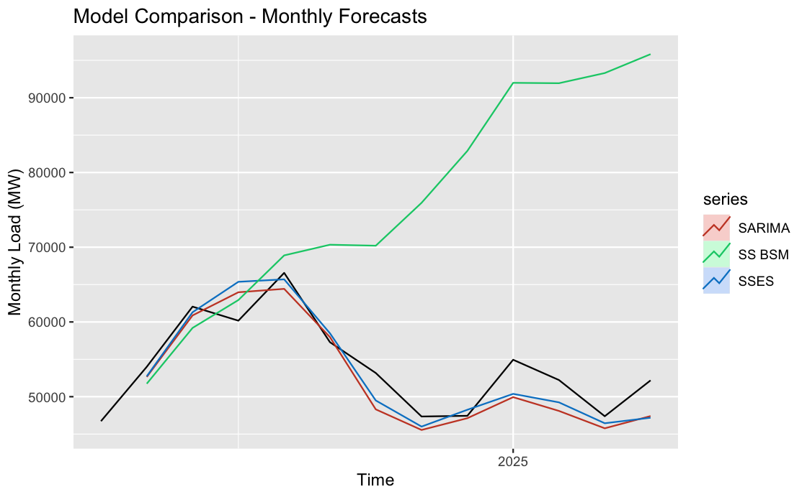

```{r setup, include=FALSE}
knitr::opts_chunk$set(echo = TRUE)
#tinytex::install_tinytex()
```

```{r, include=FALSE}
library(rvest);library(dataRetrieval);library(tidyverse);library(lubridate);library(viridis)
library(here);library(httr);library(jsonlite);library(knitr);library(kableExtra)
library(ggplot2);library(forecast);library(Kendall);library(tseries);library(outliers)
library(tidyverse);library(smooth);library(zoo)
here()
```

```{r data pull, include=FALSE}
#read csv files
ERCOT_fuelmix_2017to2018 <- read.csv(file="./Raw_Data/ERCOT_fuel_mix_112017_12312018.csv")
ERCOT_fuelmix_2019to2021 <- read.csv("./Raw_Data/ERCOT_fuel_mix_112019_12312021.csv")
ERCOT_fuelmix_2022to2025 <- read.csv("./Raw_Data/ERCOT_fuel_mix_112022_442025.csv")
ERCOT_fuelmix <- rbind(
  ERCOT_fuelmix_2017to2018,
  ERCOT_fuelmix_2019to2021,
  ERCOT_fuelmix_2022to2025
)


ERCOT_load_2017to2019 <- read.csv("./Raw_Data/ERCOT_load_112017_12312019.csv")
ERCOT_load_2020to2022 <- read.csv("./Raw_Data/ERCOT_load_112020_12312022.csv")
ERCOT_load_2023to2025 <- read.csv("./Raw_Data/ERCOT_load_112023_442025.csv")
ERCOT_load <- rbind(
  ERCOT_load_2017to2019,
  ERCOT_load_2020to2022,
  ERCOT_load_2023to2025
)

ERCOT_Temp_2017to2019 <- read.csv("./Raw_Data/ERCOT_Temp_112017_112020.csv")
ERCOT_Temp_2020to2023 <- read.csv("./Raw_Data/ERCOT_Temp_112020_112023.csv")
ERCOT_Temp_2023to2025 <- read.csv("./Raw_Data/ERCOT_Temp_112023_452025.csv")
ERCOT_temp <- rbind(
  ERCOT_Temp_2017to2019,
  ERCOT_Temp_2020to2023,
  ERCOT_Temp_2023to2025
)

```

```{r ts object creation, include=FALSE}
ERCOT_fuelmix$Date <- as.Date(ERCOT_fuelmix$interval_start_local)
ERCOT_load$Date <- as.Date(ERCOT_load$interval_start_local)

ERCOT_temp$Date <- as.Date(ERCOT_temp$interval_start_local)
ERCOT_temp$Average <- rowMeans(ERCOT_temp[,7:14], na.rm = FALSE, dims = 1)
ERCOT_temp_daily <- ERCOT_temp %>% 
  group_by(Date) %>% 
  summarise(mean(Average)) %>% 
  ungroup()

ts_load <- msts(ERCOT_load$load, seasonal.periods = c(7,365.25), 
                start = c(2017,1,1))
ts_temp <- msts(ERCOT_temp_daily[,2], seasonal.periods = c(7,365.25), 
                start = c(2017,1,1))
ts_coal_and_lignite <- msts(ERCOT_fuelmix$coal_and_lignite, seasonal.periods = c(7,365.25), 
                start = c(2017,1,1))
ts_hydro <- msts(ERCOT_fuelmix$hydro, seasonal.periods = c(7,365.25), 
                start = c(2017,1,1))
ts_nuclear <- msts(ERCOT_fuelmix$nuclear, seasonal.periods = c(7,365.25), 
                start = c(2017,1,1))
ts_solar <- msts(ERCOT_fuelmix$solar, seasonal.periods = c(7,365.25), 
                start = c(2017,1,1))
ts_wind <- msts(ERCOT_fuelmix$wind, seasonal.periods = c(7,365.25), 
                start = c(2017,1,1))
ts_natural_gas <- msts(ERCOT_fuelmix$natural_gas, seasonal.periods = c(7,365.25), 
                start = c(2017,1,1))

```

```{r train/test split, include=FALSE}
n_for <-  365

ts_load_train <- subset(ts_load,end = length(ts_load)-n_for) #stops 365 days before

#create a subset for testing purpose
ts_load_test <- subset(ts_load, start = length(ts_load)-n_for) #last 365 observations
```

# Introduction and Motivation
Load growth used to be fairly stagnant and was managed by implementing more efficiency measures (Walton, 2023). However, with innovation in electrical technologies (EVs, heat pumps, etc.) and the introduction of new load sources (crypto mining and data centers), electrical load has skyrocketed in recent years. As a result, we need new and innovative measures of responding to this load growth, such as demand response, interconnection reform, among others. The ability to forecast load growth is an interesting task, because there are both general trends (growth in electric technologies, climate change, and increasing electrification, among others) and seasonal trends (periodic variations in energy demand and consumption) that impact load.

# Relevance and Objectives
In the US, ERCOT is a market witnessing tremendous load growth. In 2018, summer peak load record was 69.5 GW, but in just 5 years, this record was broken with a 16 GW increase, with the new record hitting 85.6 GW (Wilson and Zimmerman, 2023). Moreover, ERCOT set a new winter demand peak in February 2025 with load being above 80 GW for the first time, similar figures usually seen in summer months, which highlights load growth not being exclusive to the summer (Kleckner, 2025). A lot of this can be attributed to crypto mining facilities, data centers, and industrial electrification (Guo, 2025).

At the same time, ERCOT has had some really exciting developments, from being the wholesale market with the greatest growth in solar PV and battery storage, to having the fastest interconnection process out of all the ISO/RTOs in the US, making ERCOT one of the most dynamic electric wholesale markets in North America. These developments have all helped ERCOT respond to load growth in the wake of extreme weather events like Winter Storm Uri in 2021. In this context, being able to better forecast load growth in ERCOT will help contribute to greater innovation in policy and technology to support load growth while continuing to reliably serve pre-existing load.

# Dataset Information
The ERCOT load dataset was collected from GridStatus.io, a website and Python library that provides a uniform API for accessing electricity supply, demand, and pricing data for the major ISOs in the United States (https://www.gridstatus.io/live). 

## Description
Using its “Export Data” tool, we queried hourly temperature and daily load and fuel mix data for ERCOT from January 2017 to April 2025. Below is a description of the data set retrieved: 

```{r echo=FALSE}
#data set description
dataset_description <- data.frame(
  Column1 = c("Units", "Frequency", "Subsets"),
  Load = c("MW", "Daily", ""),
  Temperature = c("Fahrenheit", "Hourly", "ERCOT Zone"),
  FuelMix = c("MW", "Daily", "Fuel (Coal and lignite, Hydro, Nuclear,
                 Solar, Wind, Natural Gas)")
)

dataset_description$Column1 <- cell_spec(dataset_description$Column1, bold = TRUE)

# Create the kable table with the first column bolded
kbl(dataset_description, caption = "Data Set Description", 
    col.names = c("", "Load", "Temperature", "Fuel Mix"), escape = FALSE) %>%
  kable_styling(full_width = FALSE, position = "center", latex_options = "hold_position") %>%
  kable_styling(latex_options="striped")

```

## Data Wrangling
The earliest available data for ERCOT fuel mix was from January 2017, so we decided to retrieve load, temperature, and fuel mix data from January 2017 onwards. After importing each of these three data sets (daily values except for temperature data) for the dates 1 January 2017 to 4 April 2025 and converting them to data frames, we created a new 'Date' column for each of the three date sets that converted the time given in the 'interval_start_local' to a YYYY-MM-DD format. Regarding the temperature data, since it is hourly data divided by zone, we first found the hourly average for each zone, then the daily average for each zone, and finally we found the daily average using all the zones in ERCOT by using rowMeans(), group_by(), and summarise(). We split the data into training and testing subsets: testing data encompasses the last 365 days of data, while the rest was classified as the training data.

Since we are working with higher frequency data with multiple seasonalities, we are using the `msts` class from package `forecast` to create time series objects for our daily data sets. Unlike the ts() function, reserved for data exhibiting single seasonality, the msts() function allows for non-integer frequency specification. We therefore created eight time series objects, one for load, one for temperature, and one for each of the fuels we are analyzing, namely coal and lignite, hydro, nuclear, solar, wind, and natural gas, with a 'seasonal.period = c(7, 365.25)' for each. Below are summaries of the data structures of each of the three wrangled data frames (for load, temperature, and fuel mix) that were then used to create time series objects by using msts():

```{r data.summary, echo=FALSE}
ERCOT_load_summary <- data.frame(
  Variable = c('interval_start_local', 'interval_start_utc', 'interval_end_local',
               'interval_end_utc', 'load', 'Date'),
  Description = c('Start Time for the Day', 'Start Time for the Day (UTC)',
                  'End Time for the Day', 'End Time for the Day (UTC)', 'Load (MW)',
                  'Date (YYYY-MM-DD)'),
  Units = c('Character', 'Character', 'Character', 'Character', 'Numeric', 
            'Date')
)

ERCOT_temp_summary <- data.frame(
  Variable = c('Date', 'mean(Average)'),
  Description = c('Date (YYYY-MM-DD)', 'Average Daily Temperature (Fahrenheit)'),
  Units = c('Date', 'Numeric')
)

ERCOT_fuelmix_summary <- data.frame(
  Variable = c('interval_start_local', 'interval_start_utc', 'interval_end_local',
               'interval_end_utc', 'coal_and_lignite', 'hydro', 'nuclear', 
               'solar', 'wind', 'natural_gas'),
  Description = c('Start Time for the Day', 'Start Time for the Day (UTC)',
                  'End Time for the Day', 'End Time for the Day (UTC)',
                  'Generation from Coal and Lignite (MW)',
                  'Generation from Hydro (MW)', 'Generation from Nuclear (MW)',
                  'Generation from Solar (MW)', 'Generation from Wind (MW)',
                  'Generation from Natural Gas (MW)'),
  Units = c('Character', 'Character', 'Character', 'Character', 'Numeric', 
            'Numeric', 'Numeric', 'Numeric', 'Numeric', 'Numeric')
)

```

```{r table1, echo=FALSE}
kable(ERCOT_load_summary, caption = "ERCOT Load Summary")
```


```{r table2, echo=FALSE}
kable(ERCOT_temp_summary, caption = "ERCOT Daily Temperature Summary")
```


```{r table3, echo=FALSE}
kable(ERCOT_fuelmix_summary, caption = "ERCOT Fuel Mix Summary")
```
# Data Exploration

## ERCOT Load

## ERCOT Temperature

## ERCOT Fuel Mix

# Methodology and Models

Modeling ERCOT load is inherently complex due to the presence of multiple seasonal patterns, non-linearities, and variability driven by weather, human behavior, and market conditions. To capture these dynamics, we used a varity of time series models, each offering unique strengths.

## STL+ETS

STL+ETS decomposes the series into seasonal, trend, and remainder components using STL (Seasonal and Trend decomposition using Loess), followed by exponential smoothing (ETS) to forecast each part. This hybrid approach is particularly useful for capturing smooth and potentially evolving seasonal and trend structures in load data.

## TBATS

TBATS (trigonometric seasoanlity, Box-Cox trasnformation, ARMA errors, Trend, and Seasonal components) is helpful for modeling ERCOT load due to its ability to handl emultiple and non-integer seasonalities, such as daily and weekly cycles, and complex seasonal interactions. Its flexibility and scalability make it valuable for long-term load forecasting.

## ARIMA + Fourier Terms

This method integrats traditional autoregressive modeling with Fourier terms as exogenous regressors, effectively capturing recurring seasonal patterns like daily temperature-related demand fluctuations. This approach enhances ARIMA's forecasting performance for load data by explicitly modeling periodicities without the need for differencing seasonal components.

## Neural Network

Neural networks use lagged values and Fourier terms. They are good at learning non-linear relationships, which are very much present in the ERCOT load data. By using historical patterns and multiple seasonality indicators, neural networks can adapt to complex load behaviors that linear models might miss.

## SARIMA

The seasonal ARIMA autofits single-seasonality patterns and is suitable when ERCOT load dispays dominant seasonal trends, such as daily or weekly cycles. Although limited in handling multiple seasonalities simultaneously, SARIMA is a reliable choice for a baseline.

## SSES

SSES (State Space Exponential Smoothing) offers a probabilistic approach to forecasting, modeling uncertainty while capturing both trend and seasonality. This model's automatic structure selection makes it useufl for adapting to changes in ERCOT load dynamics over time without manual re-sepcification.

## SSBSM

SSBM (Structural Bayesina State Space Model) is also a probabilsitic framework, and it assumes that all components (trend, seasonality, irregular) are stochastic and can evolve over time. This is power for ERCOT load forecasting where structural shifts due to policy, climate, or demand-side management interventions can occur unexpectedly.

## Scenario Generation

Lastly, we did scenario generation using Cholesky decomposition, which allowed us to create multiple realistic future ERCOT load forecasts by simulating correlated input variables. First, we calculate the historical covariance matrix of the load and the 7 predictors. Then, using Cholesky decomposition, we broke this matrix into a lower triangular matrix that captures the variables' dependencies. By multiplying random normal samples by this matrix, we generated new input scenarios that preserve historical correlations. These are then fed into an ARIMA + Fourier forecasting model to produce a range of potential load trajectories. Doing this helps to capture uncertainty in both the predictors and their influence on load.

# Results

##Model Comparison

```{r echo=FALSE}
ALLscores <- read_csv("ALLscores.csv")
names(ALLscores)[1] <- "Model"
kbl(ALLscores, 
    caption = "Forecast Accuracy for Daily Load", 
    digits = 5) %>%
  kable_styling(full_width = FALSE, position = "center", latex_options = "hold_position", bootstrap_options = c("striped", "hover", "condensed"))
```

```{r echo=FALSE}
knitr::include_graphics("model_comparison_daily.png")
```

```{r echo=FALSE}

```

##Scenario Generation

```{r echo=FALSE}
knitr::include_graphics("ercot_load_scenarios.png")
```

# Conclusions

# References
1. Guo, Kayla. Data centers are booming in Texas. What does that mean for the grid? Published 24 Jan. 2025. https://www.texastribune.org/2025/01/24/texas-data-center-boom-grid/.

2. Kleckner, Tom. Batteries, Solar Help ERCOT Meet Record Winter Peak, 20 Feb. 2025, https://www.rtoinsider.com/98816-batteries-solar-help-ercot-meet-record-winter-peak/. 

3. Walton, Robert. “US Electricity Load Growth Forecast Jumps 81% Led by Data Centers, Industry: Grid Strategies.” Utility Dive, 13 Dec. 2023, www.utilitydive.com/news/electricity-load-growing-twice-as-fast-as-expected-Grid-Strategies-report/702366/.

4. Zimmerman, Zach, and John  D Wilson. The Era of Flat Power Demand Is Over, Dec. 2023, gridstrategiesllc.com/wp-content/uploads/2023/12/National-Load-Growth-Report-2023.pdf. 